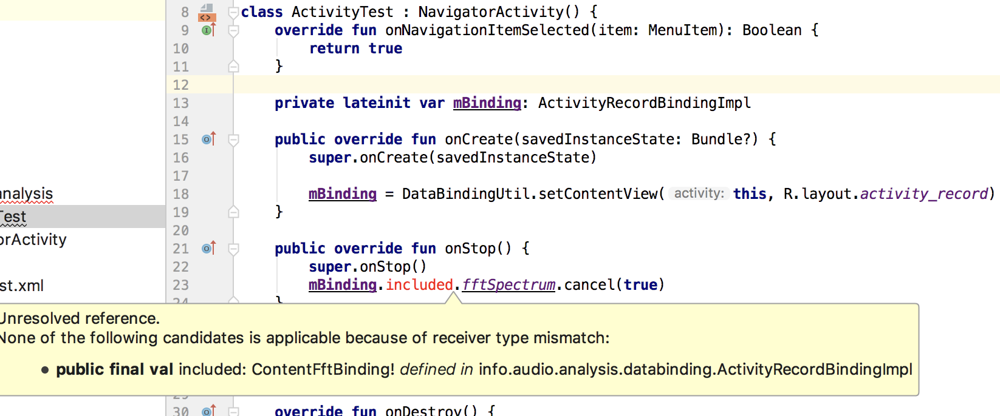

# This repo demonstrate a databinding issue

When you use a layout which you include with

```
<include
    android:id="@+id/included"
    layout="@layout/content_fft"/>
```

and you use 

```mBinding = DataBindingUtil.setContentView(this, R.layout.activity_record)```

you will see this



but it builds and runs properly

